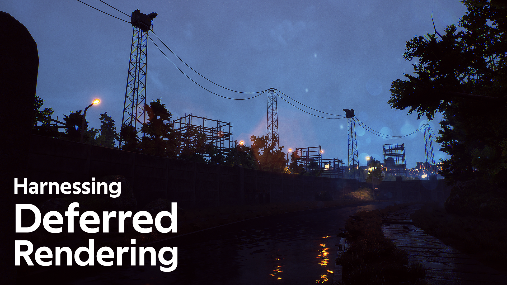

To many people, real-time rendering is still essentially “cheating”. Compared to traditional offline renderers, game engines use a wide variety of techniques and tricks to pull off the familiar real-time goodness we’re all fond of. How does it manage that? How does it all fit together while remaining manageable to artists? Is there some sort of order to the strange idiosyncrasies of modern game engine rendering? There is: it’s called **Deferred Rendering**.

Nowadays, most modern game engines use some flavor of deferred rendering to draw geometry on-screen. While it might not be perfect for every use case (and we’ll get to that later), deferred rendering has definitely won the hearts and minds of many a graphics programmer and proven itself a useful and versatile rendering path that now drives the rendering back-end of mass-market game engines like Unity, Unreal Engine and Frostbite.

What makes deferred rendering so appealing for projects with high visual complexity requirements?  How can we harness its strengths to our advantage and minimize the impact of its weaknesses when working on a real-time project? In this article, I'll go through the process of creating a small 3D scene and I’ll be detailing along the way interesting ways to take advantage of this decidedly modern render path.

### So what is deferred rendering exactly?

To best understand the whys and hows of deferred rendering, it’s useful to go back to its older sibling: **forward shading**. Before I go any further, it’s relevant to note that most of what is written in this article is a simplified, high-level overview of how game engine rendering works – if you’re looking for something more in-depth, feel free to take a look at the references listed at the end of the article.

Anyways, forward shading. The stalwart game engine rendering path of olde, forward rendering is still used to this day in mostly mobile or VR contexts for its smaller performance overhead. That’s not to say that it can’t look as good - it just performs differently under certain conditions.

With forward shading, *every single pixel of every single mesh (occluded or not by other meshes) present onscreen is rendered, then lit by every single light that reaches it*. Put more simply, every single model in a forward scene is sequentially rendered, shaded, then lit – and only then composited on top of what was rendered before (similarly to how South Park is made with overlaying cardboard cutouts, I guess?). This is all fine and dandy for smaller scenes, but two issues arise as a scene becomes more complex:

1. Meshes that are partially or even fully occluded by other meshes still get rendered and shaded in their entirety. All that high resolution rubble cleverly hidden by that half-wall? Too bad, that’s still probably getting rendered. Advances in occlusion culling technology have mitigated this problem but it’s still something to keep in mind.

2. All these partially occluded meshes that get rendered? They get lit – with grim results. Picture a mesh of a statue lit by four point lights; with forward rendering, every single pixel representing that statue on screen will internally have to be lit four times, with each lighting pass being additively stacked on top of the last one to composite the final lighting for that mesh. As a scene scales, this exponentially increases computation times – with simple scenes like a candlelit room needing to be lit potentially dozens of times in a row, once for each candle present in the scene!

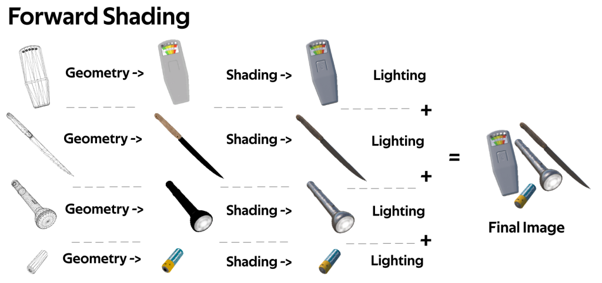

For many years, game engines skirted around these issues by baking their lights into lightmaps - which is obviously super helpful and performant but also unfortunately static. In 2020, players expect a lot more interactivity than before – What of Dark Souls where you can roll in a pile of candles and see them extinguish before your eyes or Cities Skylines where you can see tiny house lights come on at night? A new rendering paradigm had to be envisioned for the modern game engine. In comes deferred rendering.

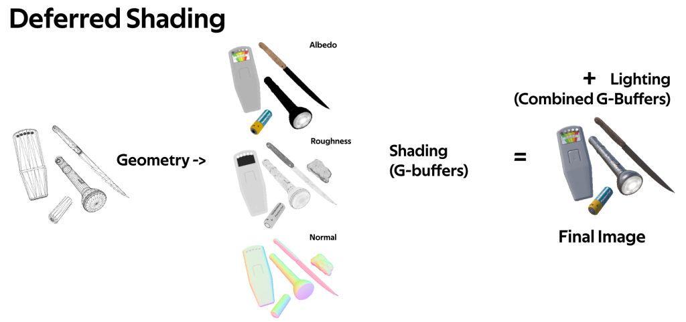

With deferred rendering, **_no lighting computations happens before all meshes visible on screen have been drawn to screen-sized textures known as G-Buffers**_. G-Buffers represent various properties of the scene like object roughness & metalness, diffuse color, scene depth and absolute world position. Imagine it like traditional hand-drawn 2D animation drawn on cells, where the final frame is a result of a bunch of overlaid cel paper.

As an example, here’s the Unreal viewport displaying world normals and a list of all buffers used by the renderer:

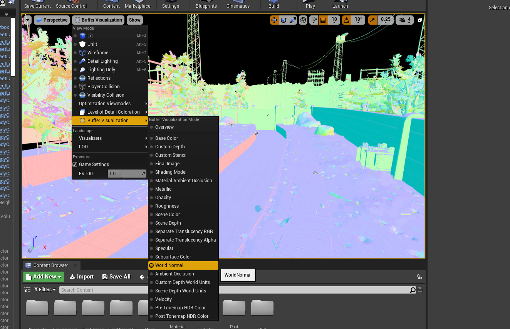

Anyways - once all meshes in a deferred scene have been drawn to these buffers, all these textures are composited into the final shaded and lit rendered image you see on your screen. If you’re familiar with the Unreal Engine buffer visualisation modes or Unity’s scene debug views, this is exactly what they are!
If words like “Roughness”, “Depth” and “Ambient Occlusion” strike you with visions of greyscale debug views, that’s because that sort of data  “glass plate” is integral to modern rendering paradigms. We’re not really rendering and lighting a bunch of objects individually anymore – instead we’re rendering what’s essentially a few colored planes that get composited into your final image.

### So what does that drastic shift in render path architecture entail?

* **A huge scalability boost**: With deferred rendering, lights only cost how many pixels they’re currently lighting on screen. Since deferred rendering only lights the final merged G-Buffer “plates” and not any singular mesh, all the other occluded meshes (and pixels) sitting behind it are discarded; saving in the process all the performance hungry work of rendering and lighting stuff that would get discarded anyways.

* **A bunch of fun data to play with**: Deferred rendering allows cool things not really achievable with forward rendering; with the ton of data that you have in the form of the G-Buffers for your frame, it’s possible to come up with some of the staples of modern game engine rendering like screen-space reflections, temporal anti-aliasing and motion blur.

### So what now?

Let's simplify and review the takeaways of deferred rendering:

1. Lights only cost about how far they cast so you can feasibly have a bunch of small dynamic lights in your scene with low performance costs.

2. The rendering cost of your scene only depends on the amount of pixels being currently rendered on your screen; things outside or behind the camera's view do not get lit and do not take any time off your GPU.

3. Since you're rendering all the lights per-pixel in one composited pass, multiple lights can affect a single object without it having to be rendered a bunch of times.

4. Rendering your final pixels as a series of composited G-Buffer "plates" gives you a bunch of fun data like screen-space normals and Depth to use for fun post-processing effects. 

Let’s concretize these ideas into a small scene. We’ll have a mix of dynamic and baked lights, overlaying geometry lit by multiple light sources and various shader hijinks like murky water, fog and post-processing effects that will take advantage of the various deferred G-Buffers.

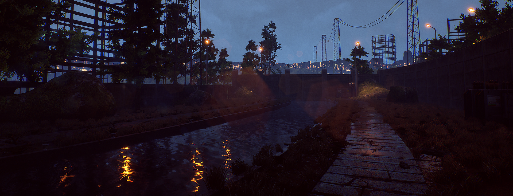

### Building the Scene

The first step to any modern scene is modular and reusable geometry. In our demo scene, we have it all, from the large scale canal meshes we walk on to tiny pebbles littering the ground. As we author the scene, it's interesting to notice all the places where deferred rendering pops up:

* Since we light our scene per pixel, we're much less limited by polygon count than we used to be. Looking at all the ground coverage is a good example of this; since we'll be rendering our merged buffer images instead of every single piece of foliage (that in this scene goes to the many thousands) we can afford to have much bushier foliage than we used to!

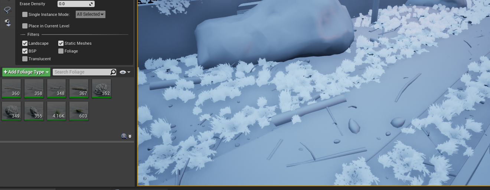

* As we jump into texture authoring, it becomes obvious that the entire modern game engine rendering pipeline (and deferred rendering in general) revolves around physically based rendering techniques. In some way this is a perfect match because having the same set of texture inputs for your renderers (eg. Maya, Substance Painter, Unity) not only allows much faster cross-collaboration between software but also helps standardize how artists and graphics engineers talk to each other about how they author and preview their content.

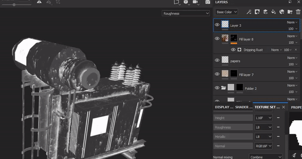

I won’t linger too much on the modeling of the scene itself as countless tutorials do that much better than I have in the time for in this article - it’s fun to keep taking in account however that countless optimization tricks are as relevant as ever with deferred rendering. Most meshes in my scene have vertex colors baked in so that I don’t have to waste extra texture information for stuff like puddles or waste time painting them in manually - It’s not because we don’t light our scenes per-vertex that we can’t use that sort of data anymore!

### Shading the Scene (and a paragraph on transparency)

With most of our meshes modeled and placed into the scene, this is what we’re going off of - a ton of meshes in our scene with no textures visible or lighting work done.

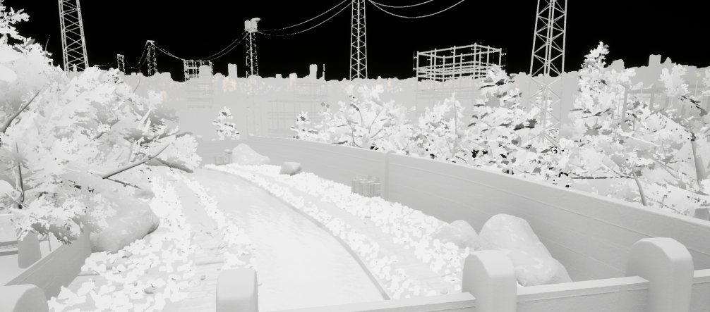

Referencing back into the explanatory section a bit, here is a completely pragmatic breakdown of the goals of the shading and surfacing stage. Make sure that:

1. All g-buffers  we talked about in the first part of the article are populated with stuff so that we’re able to render the scene properly. This means having visible content in Albedo (Base Color), Metalness and Roughness buffers, amongst others.

2. Make sure that the final result looks nice. Ultimately what looks good is completely up to you but filling the various buffers with values not handled by PBR rendering calculations (eg. having near-black Base Color values) might make the renderer act in unexpected ways, so be wary!

3. Make sure that we do these two things without slowing down the render process too much.

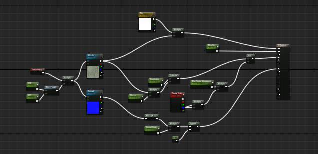

This is an Unreal Engine shader tree. To those unused to shader editing it might look a little scary but let’s use this opportunity to break down a few core concepts of shader building:

* Shaders are the way to inject pixels into the deferred rendering g-buffers - **You can compare this process to a paint-by-numbers kit**, with the various colors of the final painting indicating where various shaders will be used.

* In a shader tree, the goal is to fill as many output slots as you think is relevant for a given shader. Wherever a model is present on screen, the final computed buffer data for that space will be filled with what you output here, whether it be simple texture data, complex distortion effects or just plain colors.

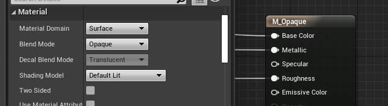

* The name of the game is to have the least amount of shaders possible in your scene and to have the ones you actually have in there render the fastest you can. In this small scene I only have seven, split by function: Water, Opaque Objects, Waving Grass, Background Cutouts, etc. Time spent practicing shader authoring will allow you to discern how to trade off between having too many shaders or having too few that are too bulky and thus slow down the renderer.

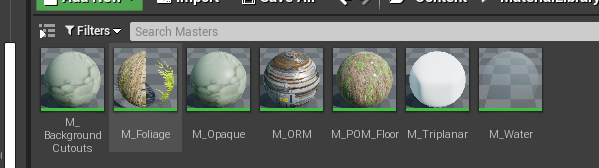

* Remember: since performance in deferred rendering is per-pixel, you should always prioritize having most of the screen render low-cost shaders. This is essentially why some games run much faster if you look at the skybox - with skybox shaders having an often pretty low complexity the rendering loop can then run much faster!

The final authoring step for surfacing is to instance your shaders into materials. It’s interesting to note that Unity uses a Shader/Material nomenclature while Unreal uses Material/Material Instances - Engine peculiarities, I guess.

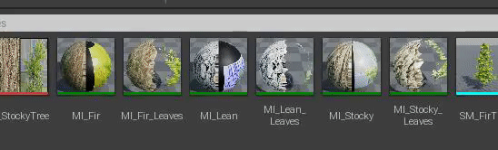

Anyways, materials allow you to instance your shaders into the scene with various settings; for example I only have one foliage shader but I have three different materials for the different tree leaves textures and wind effects I want on each tree type. Having a limited number of these is good too (and that’s probably a different article, honestly) but it’s less scary than too many shaders.

As with modeling tips, I won’t spend more time on shader authoring since other, better tutorials serve that exact purpose - but I believe that by following these simple tips you can at least remain clean and consistent in your shader authoring.

A good idea when you’re locking in on final results for the surfacing stage is to take a good look at the debug views for your scene - Here is for example the Base Color (a.k.a Albedo) buffer. Aside from the sky being black (since it’s an unlit shader that specifically does not work using a PBR algorithm) everything looks pretty good and in the right PBR compliant values:
  

  
As a final confirmation that we did everything right, let’s take a look at the shader complexity debug view:

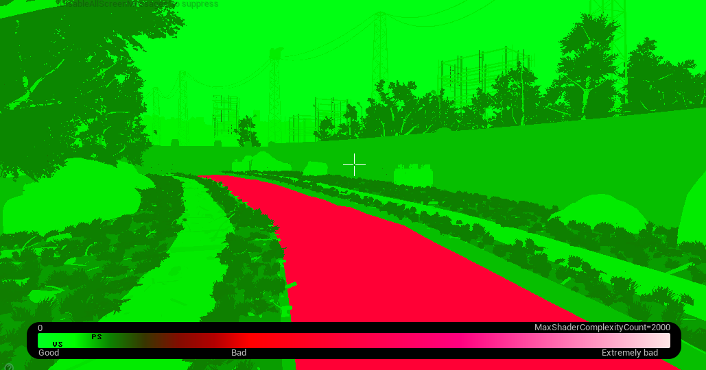

Woah, that water’s pretty bad! Let’s look at the buffers again… Wait, our water isn’t present in the base colour buffer! What’s going on?!

And this is where deferred rendering breaks completely by **not having native support for transparency**. I mean, think about it:

1. Deferred rendering calculates the final image per-pixel

2. Each final pixel is a combination of a bunch of screen-sized textures known as g-buffers that represent various aspects of the scene.

3. Models and materials present in the scene input data into the g-buffers

Using these three rules, how can deferred rendering natively handle overlapping transparent geometry? In our demo scene, what would be the final roughness g-buffer output for the combination of our highly reflective water and rough canal concrete? It’s just not something that’s doable using that rendering architecture.

While a few different options are now available (like rendering additional g-buffer passes for transparent geometry) to circumvent this issue, the most common fix that deferred engines adopt is to **just give up and render transparent geometry with forward shading overlaid on top of the deferred render**. In the shader properties panel where we can set a shader’s transparency settings, Unreal warns us of how expensive this process is:

This kind of sucks, but ultimately isn’t as much of an issue as it seems to be in most productions. With manual transparency sorting overrides, future improvements made with real-time ray-tracing or clever hacks like dithered transparency it’s possible to render a bunch of transparent stuff at a serviceable speed still - just don’t expect to have your (frosted glass) cake and eat it too.

Anyhow, with these downer paragraphs we’re done with the surfacing stage and are ready to move onto lighting the scene! It’s good to know that these two steps are usually done side by side - Even with no texture data, it’s good manners to author simple preview shaders with color  and roughness sliders and hand that over to the level and lighting artists so that they can work at the same time as you do!

### Lighting the Scene

Alright, behold the **reflection g-buffer** for our scene:

Let’s use this buffer as a kick-off point to break down how lighting in a modern PBR scene comes together:

* First, we have a scene-wide environment reflection probe for global ambient lighting. Per engine, this is an Unreal Engine Skylight or a Unity Skybox/Visual Environment. In our scene, this is what the Skybox actor is - The skybox is a huge sphere mesh around the map with our sky texture projected on it and the Skylight component essentially captures that into an HDRI image it can then reapply onto the reflection g-buffer.

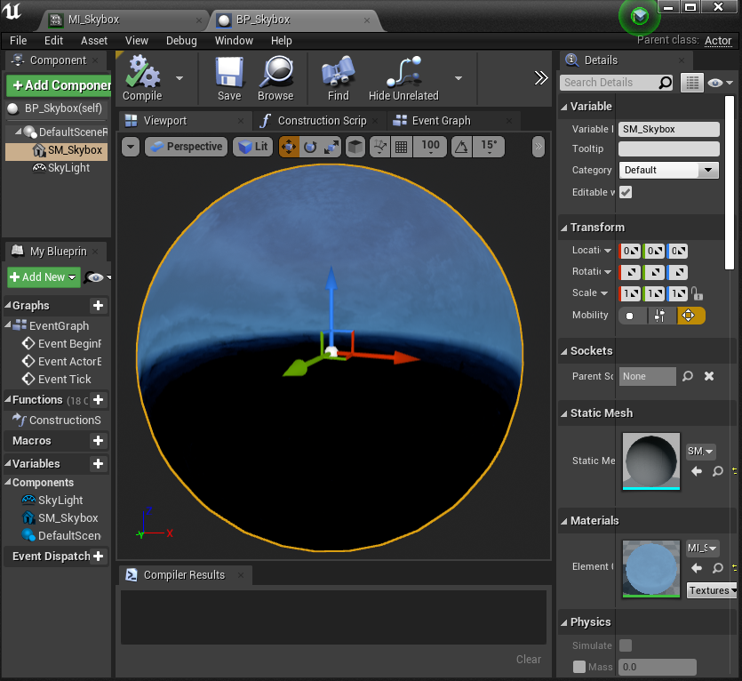

* Location specific reflection probes for localized ambient light. In our scene, distant geometry can be lit by the world reflection but we need more localized reflections probes inside the navigable areas of the map to reflect our concrete walls and foliage properly - otherwise if you were to look at a mirror placed inside of our playable area you’d only see the sky!

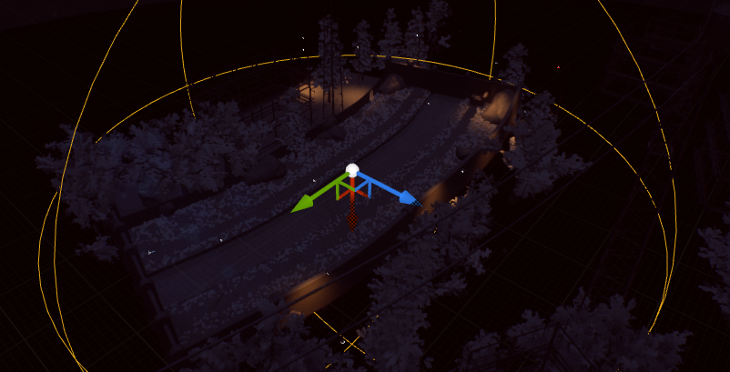

* Screen-space reflections that override the reflections obtained from the scene-wide and location-specific reflection probe - this is an interesting component of the reflection pipeline for us because it’s one of the things achievable with deferred rendering - with easy access to screen-space data like world normals, depth and scene color, it’s possible to create semi-accurate screen-space reflections at runtime. This effect is a little expensive, isn’t perfect and is thus often parametrized to show up only on very glossy surfaces - but that doesn’t mean it’s useless. For our scene, it adds a ton of definition on the water surface and muddy puddles!

It’s now relevant to note that “reflections” with physically based rendering doesn’t really just mean pure reflections as you would have on eg. polished chrome - with how PBR works, most ambient lighting is inferred from reflections, only then sometimes diffused to unrecognizable levels on very rough surfaces. Here’s one of the rocks present in the scene as an example.

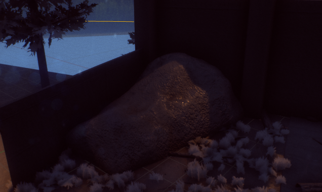

Anyhow - with the ambient lighting segment complete there’s now the rest of the lighting steps to go through:

* Direct lights in the scene cast their lights - with or without shadows. It’s interesting to note that **real-time shadows are not an inbuilt part of any lighting pipeline and are essentially tacked onto the screen after the fact** - that’s why shadows are expensive to render regardless of if you’re using forward or deferred rendering! Most real-time shadows use a process called shadow mapping which depending on the engine may or may not have a few limitations like a maximum number of overlapping shadows. 

It’s good to note now that it’s possible to be clever when lighting to minimize the need for shadow casting - With lights in deferred rendering costing only about how far they cast (and thus how many pixels they illuminate on the final lighting g-buffer) you can probably skip shadows on more punctual lighting like christmas trees, garden lights and fireflies for a nice performance boost.

* We finally apply Global Illumination, also known as Indirect Light our Bounced Light. While incredible advances in real-time raytracing or screen-space global-illumination (functioning roughly in the same way as screen-space reflection) have mitigated the need for lightmapping, we’re still a short way off of true real-time GI. Unless you have an RTX card, you’ll probably have to keep baking global illumination to textures for now. This is what was done for the demo scene.

After all of this ambient, indirect and direct light information has been obtained and sent to direct and indirect lighting G-buffers,, the actual PBR calculations begin and every single buffer we authored during the surfacing and lighting phase gets sent into the actual renderer code to output the final image. The actual PBR math varies per renderer, resulting in slight visual variations, from Unreal’s curated realistic look to Disney’s stylized PBR experiments.

### Post-Processing

The final step is post-processing. With game engines now all rendering their final output as HDR images, a major part of what makes modern real-time renders look the way they do comes together here - and is made possible with deferred rendering:

* A tonemapper remaps undisplayable HDR values into pixels displayable by a monitor. Careful tonemapper tweaking is often what makes some real-time renders stand out as “more realistic”.

* Screen-Space Ambient Occlusion taps into the depth map (amongst others) to inject soft shadowing into the scene.

* As I wrote a few paragraphs above, Screen-Space Reflections get injected into the reflection buffer.

* Bloom uses pre-tonemapper HDR values to diffuse light into the virtual camera lenses.

Amongst these effects we traditionally interpret as post-processing, a few other things happen before we render out the final image to the viewport:

* Fog and other volumetric effects are often rendered last using either tricks with the depth map or ray marching. Effects like these are still traditionally placed in a separate menu than mainline post-processing effects for UX reasons (since you wouldn’t normally associate fog with post-processing)!

* When we’re done with everything, we (often) anti-alias our scene with Temporal Anti-Aliasing. As with the lacking transparency support, deferred rendering doesn’t really have time to individually smooth out the edge of meshes when rendering everything all at once into g-buffers (as compared to forward rendering that allows for an MSAA antialiasing pass on every object rendered).

TAA uses motion buffers in the scene to identify aliasing so it can look a little weird in screenshots... but it looks great in movement and at high resolutions and framerates  so it’s pretty much a match made in heaven for real-time rendering!

This is our final result, with first the raw lighting output then the final image! It’s fun to see how while textures add some flavour to the scene, lighting is really where it all comes together - I guess that’s why the scalable nature of deferred rendering is so convenient!

### Final Thoughts

Deferred rendering isn’t perfect - but for most purposes it’s the best we’ve got right now. As with most things with game development it allows you to do a whole lot of amazing stuff with only a few annoying drawbacks you can somewhat easily circumvent.

While as a whole the industry isn’t shy of experimenting with how to best implement deferred rendering (eg. clustered or tiled rendering), looking at cutting-edge rendering trends like real-time raytracing reveals that deferred rendering isn’t going anywhere. Using that as an example, real-time raytracing is essentially running a very-low-sample render on the g-buffers and then denoising the results! 

It’s interesting to notice that with the advent of more performant mobile devices like the Oculus Quest (that are most of the time however still too weak for deferred rendering), forward rendering hasn’t really gone anywhere either - and especially as we talked above with the fact that transparency is still of a hassle in deferred it probably won’t go anywhere soon either, at least for now.

We can dream as hard sci-fi does and imagine a single monolithic rendering path that handles everything perfectly... but for now we’ll have to make our way through what’s offered to us. Into the trenches!
 

  
### References 

* [The sample project for this article!](https://github.com/alexismorin/Harnessing-Deferred-Rendering)

* [Avalanche Studios on Clustered Rendering](http://www.humus.name/Articles/PracticalClusteredShading.pdf)

* [Unity’s Excellent Forward vs. Deferred Rendering Comparison](https://docs.unity3d.com/Manual/RenderingPaths.html)

* [Unreal’s Rendering Overview Documentation](https://docs.unrealengine.com/en-US/Engine/Rendering/Overview/index.html)

* [Unreal’s Realtime Raytracing Primer](https://docs.unrealengine.com/en-US/Engine/Rendering/RayTracing/index.html)

* [Unreal Screen-Space Global Illumination](https://docs.unrealengine.com/en-US/Engine/Rendering/LightingAndShadows/ScreenSpaceGlobalIllumination/index.html)

* [More in-depth Forward vs. Deferred Information](https://gamedevelopment.tutsplus.com/articles/forward-rendering-vs-deferred-rendering--gamedev-12342)

* [NVIDIA’s “What’s the difference between Ray-Tracing and Rasterization](https://blogs.nvidia.com/blog/2018/03/19/whats-difference-between-ray-tracing-rasterization/)

* [Physically Based Shading at Disney](https://disney-animation.s3.amazonaws.com/library/s2012_pbs_disney_brdf_notes_v2.pdf)

* [Deferred Transparency by Martin Evans](https://martindevans.me/game-development/2015/10/09/Deferred-Transparency/)
